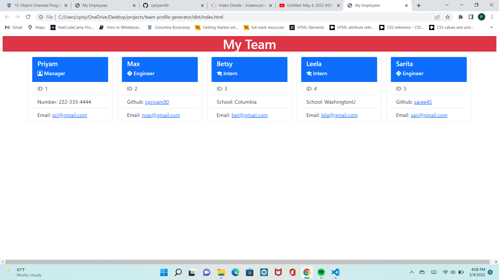

# team-profile-generator

## Description
This application helps a user generate a HTML that holds employee information for a software engineering company using Node.js from their terminal. The application is based on the principles of object-oriented programming.

## Table of Contents
* [Usage](#Usage)
* [Video-Link](#Video-Link)
* [Credits/Citations](#Credits/Citations)
* [Features](#Features)
* [Applications-Used](#Applications-Used)
* [Screenshots](#Screenshots)

## Usage
This application was created using node packages of Jest and Inquirer. Since the application is based on OOP, four classes were created: Employee, Manager, Engineer, and Intern. Employee is the first class, and the other classes are an extension of this class. The corresponding tests were performed using jest to ensure the code will pass. The execution of the tests is recorded in the video.
To generate a HTML, user must have Node.js installed and then run the command node index.js from your terminal. The user, who is the manager of the team, will be prompted to answer a few questions such as their name and email. Once user answers questions about themself, the user will be asked if they would like to add additinal employees such as an Engineer or an Intern. Once user is completed adding all the employees information,a new HTML file will be generated called index.html. The file 'index.html' is the sample HTML that was created using the application, please see in the code files, it is saved in the 'dist' folder. See attached screenshots for how the generated HTML will look. Click on the video link to see the application in action!

## Video-Link
**[Click here for video link](https://www.youtube.com/watch?v=nOvaxIVZDSo)**

## Credits/Citations
* Module 10 lessons on OOP
* Tutor Abdullah explained what jest is and how to run my tests on my terminal. He also helped me understand the role of classess and execute the  logic for the flow of my index.js file.
* W3 schools tutorial on how to use "mailto" command in html for email address
* Bootsrap documentation for styling the HTML
* Bootstrap icons documentation
* Jest documentation for running tests

## Features
The manager can link their email and upon interaction the user will be taken to the default mailing application to send an email. Additionally, when a user clicks on the github username for the engineer, the corresponding github page will open in a new window.

## Applications-Used
* Node.js
* Inquirer
* Jest
* Markdown
* JavaScript
* Bootstrap

## Screenshots
See below screenshots of generated HTML

